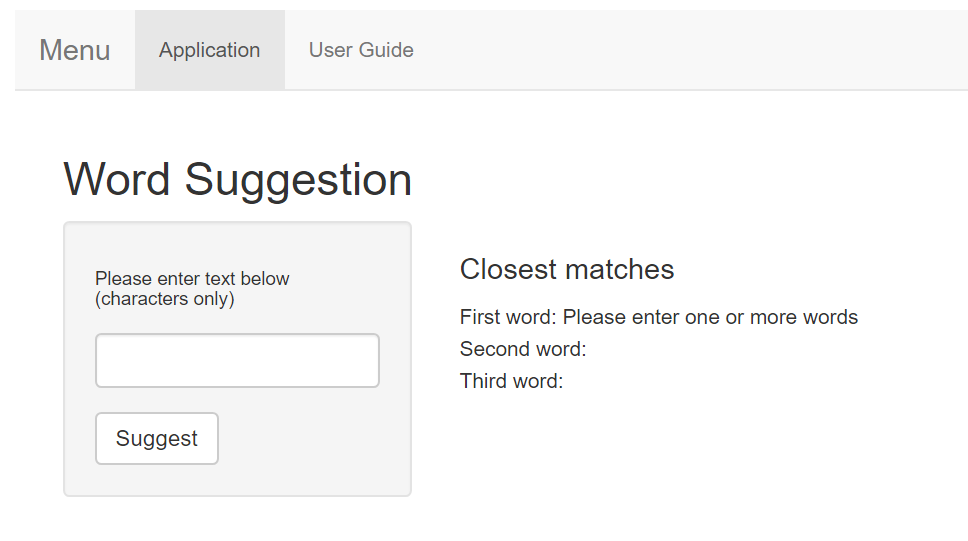

```{r setup, include=FALSE}
knitr::opts_chunk$set(echo = FALSE)
```

## Overview
- WordSuggestion app will provide three suggested words based on the user input text.
- The three suggested words are ranked from 1 (top) to three (bottom).
- WordSuggestion app is based on corpus of textual information collected over many sources such as twitter, blogs, and news.
- The datasets for the corpus is from a company SwiftKey.

## Algorithm
- Datasets from SwiftKey have been cleaned and sampled for the corpus of textual informaion.

- The sampled dataset is tokenized into n-grams for building prediction model.

- Three n-grams datasets consisting of unigram, bigram, and trigram have been created and used for word suggestion/prediction.

## App Interface
```{r, echo=FALSE, out.width='90%'}

```

## App Usage
- The application contains two tabs: "**Application**" which is the main interface and "**User Guide**" containing guides on app usage.

- In the main interface, a textbox gets the user input words and a button named "**Suggest**" when clicked provide suggested words based on the input.

- Click this [link](https://sovann.shinyapps.io/WordSuggestion/) to access the web app. 

- Source code is [here](https://github.com/preysovann/wrdsgst).
